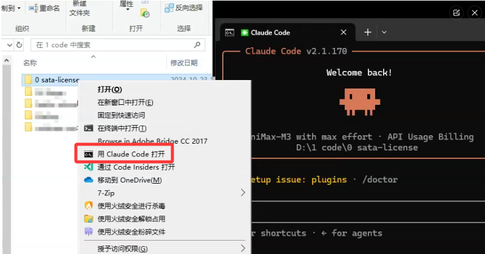

# Claude Here（中文）

> 在 Windows 右键菜单里加一个 **"Open Claude Here"**，在选中的目录里启动 Claude Code。
>
> [English](README.md)

   

---

## 它做什么

安装 `install` 后，Windows 资源管理器的右键菜单会多出一项：

| 在哪里右键 | 菜单显示 |
|---|---|
| 文件夹**内部空白处** | `用 Claude Code 打开` |
| 一个**文件夹**本身 | `用 Claude Code 打开` |

具体显示的标签跟随系统区域，见下面的 [语言](#语言) 小节。



点一下就会在那个目录打开终端，运行 `claude`。

> **Win11 说明**：在 Win11 modern 菜单里，这个项可能会藏在 **"显示更多选项"** 下面。这是 Win11 菜单的默认行为，不是 bug，功能本身能正常使用。

---

## 安装

```powershell
npx -y claude-here install
```

完事。`install` 只会写当前用户（`HKCU`）的注册表项，**不需要管理员权限**。`npx claude-here uninstall` 会把刚才写的项都清掉，不留残余。

### 语言

右键菜单里显示的标签跟随系统区域：英文系统显示 **`Open Claude Here`**，中文系统显示 **`用 Claude Code 打开`**。要覆盖：

```powershell
npx -y claude-here install --lang=zh
npx -y claude-here install --lang=en
```

或者设环境变量 `CLAUDE_HERE_LANG=zh`（或 `en`），对当前 shell 生效。

### 从源码安装（不走 npm）

如果想先看一遍代码再跑，或者不想用 npm：

```bash
git clone https://github.com/klarkxy/claude-here
cd claude-here
npm run register         # = node bin/claude-here.cjs install
npm run unregister       # = node bin/claude-here.cjs uninstall
```

`install` / `uninstall` 子命令的用法跟 `npx` 方式一样，只是没版本固定 — 跑的是你 clone 下来的那份。`--lang` 同样能用。

### 卸载

```powershell
npx claude-here uninstall
```

---

## 系统要求

- Windows 10 或 11
- Node.js **18+**
- 已装 [Claude Code CLI](https://docs.claude.com/en/docs/claude-code)（`where claude` 能输出一行路径）
- 三选一：Windows Terminal、PowerShell 7、或 `cmd.exe`（最后这个永远有）

---

## 工作原理

`install` 写 4 个注册表值（当前用户，无需管理员）：

```
HKCU\Software\Classes\Directory\Background\shell\OpenClaudeHere   (文件夹内部空白处)
HKCU\Software\Classes\Directory\shell\OpenClaudeHere              (文件夹本身)
```

每项下面有个 `command` 子键，值是一段**自包含**的命令行，资源管理器右键时直接执行。`uninstall` 把这两组键删掉。

终端在 install 时一次性选定（wt → pwsh → cmd 顺序回退），`claude` 的**绝对路径**也用 `where claude` 解析后直接写进注册表，完全不依赖资源管理器进程的 PATH 或你 shell 的 PATH。

菜单图标取的是 `@anthropic-ai/claude-code` 包里 `claude.exe` 自带的嵌入图标，install 时解析成绝对路径写进去；找不到时回落到 `cmd.exe`。
